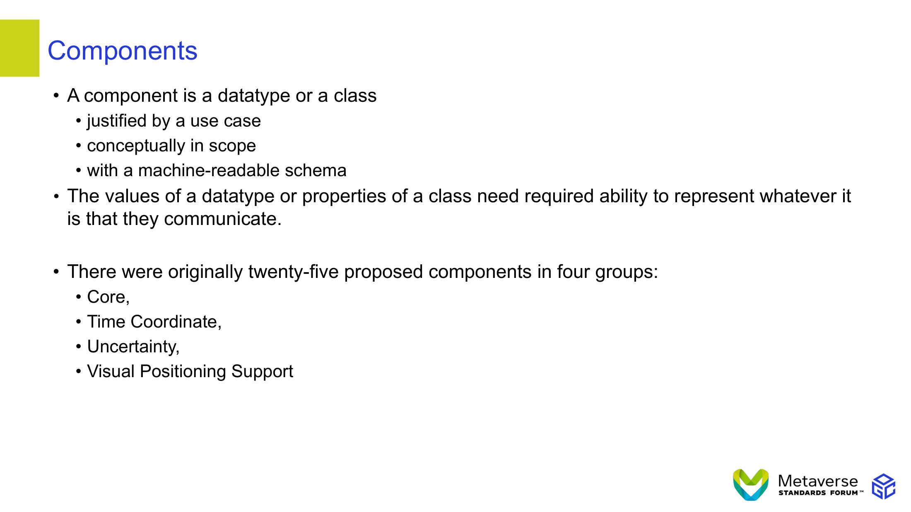
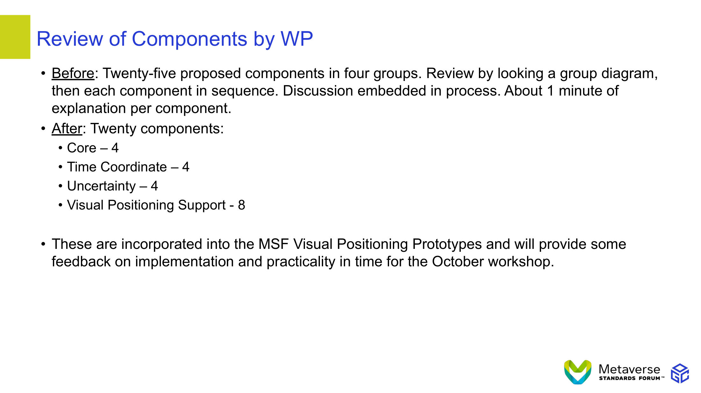
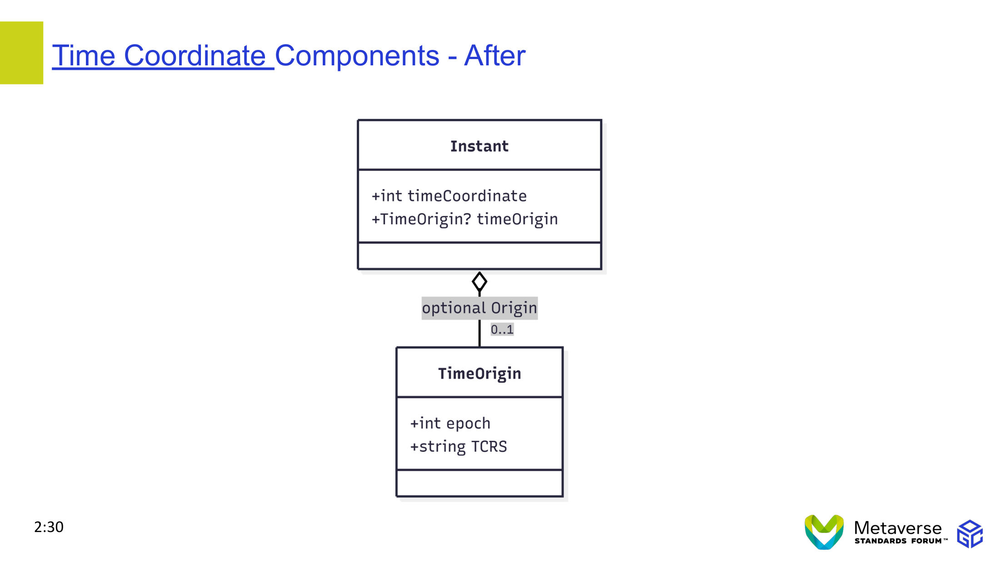
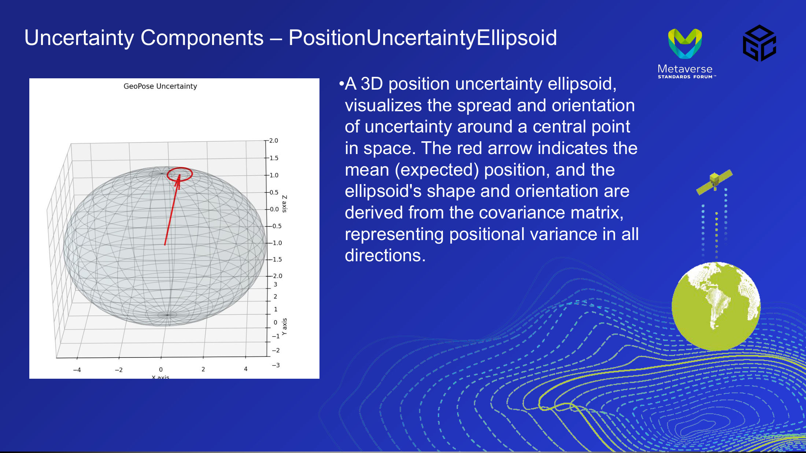
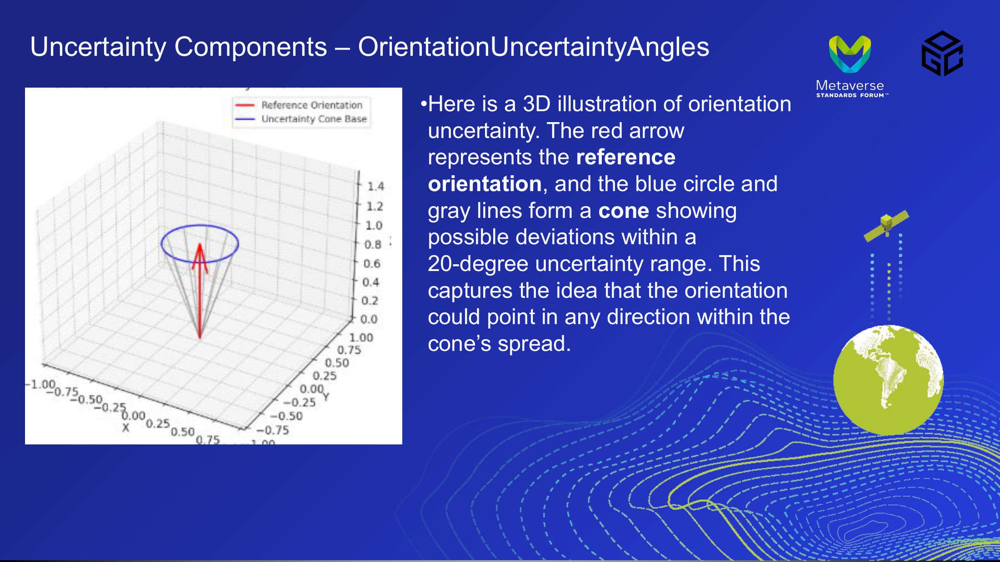
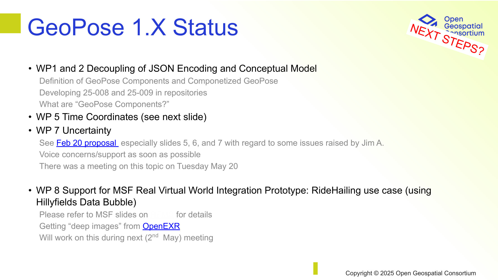
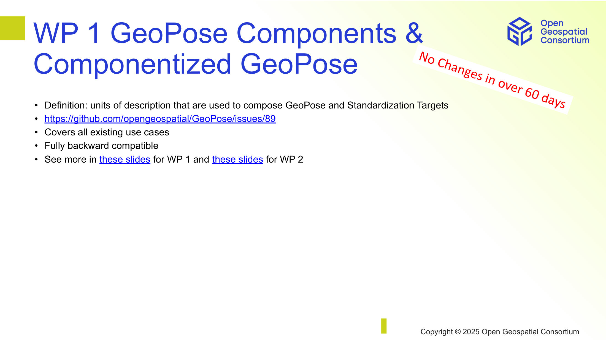
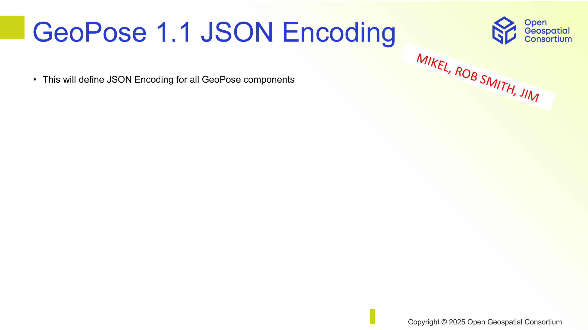
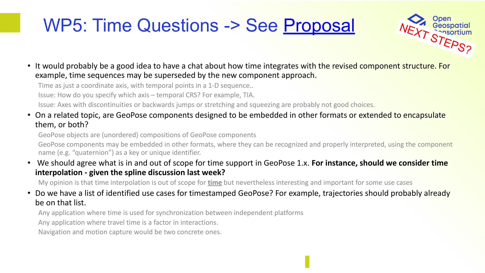

# Slide analysis report

- Source PDF: `refactoring-resources/GeoPose 1.1 slides.pptx.pdf`
- Rendered images: `refactoring-resources/slide-images-lowres`

## Slide 01



**Embedded PDF text**
```text
• A component is a datatype or a class
• justified by a use case
• conceptually in scope
• with a machine-readable schema
• The values of a datatype or properties of a class need required ability to represent whatever it 
is that they communicate. 
• There were originally twenty-five proposed components in four groups: 
• Core, 
• Time Coordinate, 
• Uncertainty, 
• Visual Positioning Support
Components
```

**OCR text (macOS Vision)**
```text
Components
• A component is a datatype or a class
• justified by a use case
• conceptually in scope
• with a machine-readable schema
• The values of a datatype or properties of a class need required ability to represent whatever it
is that they communicate.
• There were originally twenty-five proposed components in four groups:
• Core,
• Time Coordinate,
• Uncertainty,
• Visual Positioning Support
Metaverse
```

## Slide 02



**Embedded PDF text**
```text
• Before: Twenty-five proposed components in four groups. Review by looking a group diagram, 
then each component in sequence. Discussion embedded in process. About 1 minute of 
explanation per component.
• After: Twenty components:
• Core – 4
• Time Coordinate – 4
• Uncertainty – 4
• Visual Positioning Support - 8 
• These are incorporated into the MSF Visual Positioning Prototypes and will provide some 
feedback on implementation and practicality in time for the October workshop.
Review of Components by WP
```

**OCR text (macOS Vision)**
```text
Review of Components by WP
• Before: Twenty-five proposed components in four groups. Review by looking a group diagram,
en each component in sequence. Discussion embedded in process. About 1 minute of
explanation per component.
• After: Twenty components:
• Core - 4
• Time Coordinate - 4
• Uncertainty - 4
• Visual Positioning Support - 8
• These are incorporated into the MSF Visual Positioning Prototypes and will provide some
feedback on implementation and practicality in time for the October workshop.
Metaverse
STANDARDS FORUM™
```

## Slide 03


**Embedded PDF text**
```text
Core Components Before and After
2:20
```

**OCR text (macOS Vision)**
```text
Core Components Before and After
Geodetic or geographic position defined by two angles and a height
Position
+number lat
+number lon
+number h
Orientation defined by the three vector and one scalarincomponents of a unit quaternion
Quaternion
+number x
+number y
+number z
+number w
Orientation defined by three angles in degrees:Inyaw, pitch, and roll
Angles
+number yaw
+number pitch
+number roll
2:20
A variable length array of coordinate values
Coordinates
+numberl] coordinates
Metaverse
STANDArDS FORUM™
```

## Slide 04



**Embedded PDF text**
```text
Time Coordinate Components - After
2:30
```

**OCR text (macOS Vision)**
```text
Time Coordinate Components - After
Instant
+int timeCoordinate
+TimeOrigin? timeOrigin
optional Origin
0..1
TimeOrigin
+int epoch
+string TCRS
2:30
Metaverse
```

## Slide 05


**Embedded PDF text**
```text
Uncertainty Components - After
2:40
```

**OCR text (macOS Vision)**
```text
Uncertainty Components - After
PoseUncertainty
+PositionUncertainty positionUncertainty
+OrientationUncertainty orientationUncertainty
Confidence
+double confidence
position uncertainty
ellipsoid
angular orientation
uncertainty
PositionUncertainty
+ double deltaX
+ double deltaY
+double deltaZ
OrientationUncertainty
+ double deltaPhi
+double deltaTheta
2:40
Metaverse
```

## Slide 06



**Embedded PDF text**
```text
Uncertainty Components – PositionUncertaintyEllipsoid
•A 3D position uncertainty ellipsoid, 
visualizes the spread and orientation 
of uncertainty around a central point 
in space. The red arrow indicates the 
mean (expected) position, and the 
ellipsoid's shape and orientation are 
derived from the covariance matrix, 
representing positional variance in all 
directions.
```

**OCR text (macOS Vision)**
```text
Uncertainty Components - PositionUncertaintyEllipsoid
Metaverse
STANDARDS FORUM™
GeoPose Uncertainty
-2.0
-1.5
-1.0
-0.5
N
-0.0
-0.5
-1.0
-1.5
-2.0
2
•A 3D position uncertainty ellipsoid,
visualizes the spread and orientation
of uncertainty around a central point
in space. The red arrow indicates the
mean (expected) position, and the
ellipsoid's shape and orientation are
derived from the covariance matrix,
representing positional variance in all
directions.
-1 >
-2
-3
-2
```

## Slide 07



**Embedded PDF text**
```text
Uncertainty Components – OrientationUncertaintyAngles
•Here is a 3D illustration of orientation 
uncertainty. The red arrow 
represents the reference 
orientation, and the blue circle and 
gray lines form a cone showing 
possible deviations within a 
20-degree uncertainty range. This 
captures the idea that the orientation 
could point in any direction within the 
cone’s spread.
```

**OCR text (macOS Vision)**
```text
Uncertainty Components - OrientationUncertaintyAngles
Metaverse
STANDARDS FORUM™
Reference Orientation
Uncertainty Cone Base
1.000.750.590.28.00 0.25 0.50
0,75
+ 1.4
1.2
1.0
0.8
0.6
- 0.4
0.2
0.0
1.00
0.75
0.50
0.25
0.00,
-0.25
-0.50
-0.75
•Here is a 3D illustration of orientation
uncertainty. The red arrow
represents the reference
orientation, and the blue circle and
gray lines form a cone showing
possible deviations within a
20-degree uncertainty range. This
captures the idea that the orientation
could point in any direction within the
cone's spread.
608100
```

## Slide 08


**Embedded PDF text**
```text
Image Element Components –
(Mostly from OSCP GeoPose Protocol)
```

**OCR text (macOS Vision)**
```text
DepthMap: raster image with depth values
Optical/scale calibration
DepthMap
+DepthPixell] depthMap
+int width
+int height
CameraCalibration
+float Fx
+float Fy
+float Cx
+float Cy
+float W1
+float W2
+float P1
+float P2
+float W3
Volumetric radiance samples
RadianceField
-GausslanhadiancesamplesUl radiancerlele
contains
DepthPixel
+ ColorSample colorSample
+float depth
contains
GaussianRadianceSample3D
+Coordinates coordinates
+floati] Scale
+Quaternion quatemioni
+ColorSample colorSample
+float Alpha
ColorSample
Coordinates
Tini colors
+floati] coordinates
Image Element Components -
(Mostly from OSCP GeoPose Protocol)
Camera pose and scale
CameraModel
+float focalLength
+float aspectRatio
+float nearClip
+float farClip
+float fieldOfView
+float sensorWidth
+float sensorHeight
tooors nales cooreinares
+Quaternion quaternion
Quaternion
+float x
+float y
+float z
Collection of targets
TargetSet
+ Targetf] targets
contains
Target
+ TimeLimitedID timeLimitedID
+float azimuth
+float altitude
+float range
Identified, located object
TimeLimitedID
+string ID
+Instant termination
expires_at
0.1
Instant
+int timeCoordinate
tint epoch [0..1]
+string TCRS [0..1]
letaverse
ANDARDS FORUM™
```

## Slide 09



**Embedded PDF text**
```text
GeoPose 1.X Status
• WP1 and 2 Decoupling of JSON Encoding and Conceptual Model
Definition of GeoPose Components and Componetized GeoPose
Developing 25-008 and 25-009 in repositories
What are “GeoPose Components?”
• WP 5 Time Coordinates (see next slide)
• WP 7 Uncertainty
See Feb 20 proposal  especially slides 5, 6, and 7 with regard to some issues raised by Jim A.
Voice concerns/support as soon as possible
There was a meeting on this topic on Tuesday May 20
• WP 8 Support for MSF Real Virtual World Integration Prototype: RideHailing use case (using 
Hillyfields Data Bubble)
Please refer to MSF slides on RFMS for details
Getting “deep images” from OpenEXR
Will work on this during next (2nd  May) meeting
Copyright © 2025 Open Geospatial Consortium
NEXT STEPS?
```

**OCR text (macOS Vision)**
```text
GeoPose 1.X Status
Open
Geospatial
*ansortium
NEXT STEPS?
• WP1 and 2 Decoupling of JSON Encoding and Conceptual Model
Definition of GeoPose Components and Componetized GeoPose
Developing 25-008 and 25-009 in repositories
What are "GeoPose Components?"
• WP 5 Time Coordinates (see next slide)
• WP 7 Uncertainty
See Feb 20 proposal especially slides 5, 6, and 7 with regard to some issues raised by Jim A.
Voice concerns/support as soon as possible
There was a meeting on this topic on Tuesday May 20
• WP 8 Support for MSF Real Virtual World Integration Prototype: RideHailing use case (using
Hillyfields Data Bubble)
Please refer to MSF slides on
for details
Getting "deep images" from OpenEXR
Will work on this during next (2nd May) meeting
Copyright © 2025 Open Geospatial Consortium
```

## Slide 10



**Embedded PDF text**
```text
WP 1 GeoPose Components & 
Componentized GeoPose
• Definition: units of description that are used to compose GeoPose and Standardization Targets
• https://github.com/opengeospatial/GeoPose/issues/89 
• Covers all existing use cases
• Fully backward compatible
• See more in these slides for WP 1 and these slides for WP 2
Copyright © 2025 Open Geospatial Consortium
No Changes in over 60 days
```

**OCR text (macOS Vision)**
```text
WP 1 GeoPose Components &
Componentized GeoPose
• Definition: units of description that are used to compose GeoPose and Standardization Targets
• https://github.com/opengeospatial/GeoPose/issues/89
• Covers all existing use cases
• Fully backward compatible
• See more in these slides for WP 1 and these slides for WP 2
Open
Geospatial
Consortium
No Changes in over 60 days
Copyright © 2025 Open Geospatial Consortium
```

## Slide 11



**Embedded PDF text**
```text
GeoPose 1.1 JSON Encoding
• This will define JSON Encoding for all GeoPose components
Copyright © 2025 Open Geospatial Consortium
MIKEL, ROB SMITH, JIM
```

**OCR text (macOS Vision)**
```text
GeoPose 1.1 JSON Encoding
Open
Geospatial
Consortium
• This will define JSON Encoding for all GeoPose components
MIKEL, ROB SMITH, JIM
Copyright © 2025 Open Geospatial Consortium
```

## Slide 12



**Embedded PDF text**
```text
WP5: Time Questions -> See Proposal
• It would probably be a good idea to have a chat about how time integrates with the revised component structure. For 
example, time sequences may be superseded by the new component approach. 
Time as just a coordinate axis, with temporal points in a 1-D sequence..
Issue: How do you specify which axis – temporal CRS? For example, TIA.
Issue: Axes with discontinuities or backwards jumps or stretching and squeezing are probably not good choices.
• On a related topic, are GeoPose components designed to be embedded in other formats or extended to encapsulate 
them, or both?
GeoPose objects are (unordered) compositions of GeoPose components
GeoPose components may be embedded in other formats, where they can be recognized and properly interpreted, using the component 
name (e.g. “quaternion”) as a key or unique identifier.
•  We should agree what is in and out of scope for time support in GeoPose 1.x. For instance, should we consider time 
interpolation - given the spline discussion last week?
My opinion is that time interpolation is out of scope for time but nevertheless interesting and important for some use cases
• Do we have a list of identified use cases for timestamped GeoPose? For example, trajectories should probably already 
be on that list.
Any application where time is used for synchronization between independent platforms
Any application where travel time is a factor in interactions.
Navigation and motion capture would be two concrete ones.
NEXT STEPS?
```

**OCR text (macOS Vision)**
```text
WP5: Time Questions →> See Proposal
Open
Geospatial
ransortium
NEXT STEPS?
• It would probably be a good idea to have a chat about how time integrates with the revised component structure. For
example, time sequences may be superseded by the new component approach.
Time as just a coordinate axis, with temporal points in a 1-D sequence..
Issue: How do you specify which axis — temporal CRS? For example, TIA.
Issue: Axes with discontinuities or backwards jumps or stretching and squeezing are probably not good choices.
• On a related topic, are GeoPose components designed to be embedded in other formats or extended to encapsulate
them, or both?
GeoPose objects are (unordered) compositions of GeoPose components
GeoPose components may be embedded in other formats, where they can be recognized and properly interpreted, using the component
name (e.g. "quaternion") as a key or unique identifier.
• We should agree what is in and out of scope for time support in GeoPose 1.X. For instance, should we consider time
interpolation - given the spline discussion last week?
My opinion is that time interpolation is out of scope for time but nevertheless interesting and important for some use cases
• Do we have a list of identified use cases for timestamped GeoPose? For example, trajectories should probably already
be on that list.
Any application where time is used for synchronization between independent platforms
Any application where travel time is a factor in interactions.
Navigation and motion capture would be two concrete ones.
```
