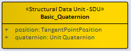
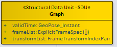
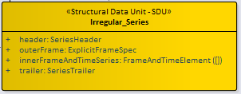
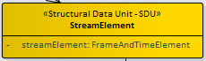

== Components and Standardization Targets

=== General

Classes, attributes, and relationships of the GeoPose domain are specified in a (normative) GeoPose UML static class model - the GeoPose Logical Model. Standardization Targets are specified by encoding-neutral elements of the Logical Model. These components are elements (classes or attributes) in the Logical Model with the "component" stereotype. Components may have additional Requirements limiting the range, multiplicity, representation or other constraining and testable characteristics. Components are used individually or in combination combined to express each of the Standardization Targets.

Components provide Standardization Targets that are independent of serialization/encoding format. This allows multiple equivalent serializations to be defined. Each component that may be expressed as a concrete data object is associated with a corresponding element (class or attribute) in the logical model.

The Basic and Advanced Standardization Targets differ in the level of options and flexibility in the Frame Specifications. The Composite Targets offer approaches to packaging Frame Transforms. The Targets are the data classes that are specified by the GeoPose Standard. There are eight Standardization Targets denoted by bold terms in the following categories:

. Basic - Satisfy most use cases
.. Orientation by Yaw, Pitch, and Roll (YPR) rotations about z, y, x axes: *Basic-YPR* Target
.. Orientation by unit quaternion: *Basic-Quaternion* Target
. Configurable - Flexible enough for complex use cases including full 6DoF transformations: *Advanced* Target
. Composite - Efficient structures for linked and sequential GeoPoses
.. Linked linear sequence of poses linked by full 6DoF transformations: *Chain* Target
.. General linked poses: *Graph* Target
.. Sequence
... Series
.... Time series with constant time spacing: *Regular* Time series Target
.... Time series with per-GeoPose time: *Irregular* Time series Target
... Open-ended sequence of time-stamped GeoPoses: *Stream* Target

[NOTE]
The definition of a reference frame by an external standard in *not* specified. GeoPose does use a three-part designation of an external frame specification using the three fields _authority_, _ID_, and _parameters_. The interpretation of the contents of these fields is outside the scope of GeoPose.

=== Global requirements

Global requirements apply to all components and Standardization Targets.

[yaml2text,modspec/yaml/global-rc.yaml,group]
----

include::modspec/requirements_class.liquid[]
----

=== Common requirements

[[tangent-point-specification]]
==== Tangent point specification requirements

[yaml2text,modspec/yaml/tangent-point-rc.yaml,group]
----

include::modspec/requirements_class.liquid[]
----

[[common-frame-specification]]
==== Frame specification requirements

[yaml2text,modspec/yaml/frame-spec-rc.yaml,group]
----

include::modspec/requirements_class.liquid[]
----

[[time-specification]]
==== Time specification requirements

[yaml2text,modspec/yaml/time-rc.yaml,group]
----

include::modspec/requirements_class.liquid[]
----

=== GeoPose components (informative)

This clause provides an informative overview of GeoPose components that are used to compose GeoPose objects and Standardization Targets.
The normative definitions of these components, their associations, and any component stereotypes are specified in the GeoPose Logical Model.

In this document, a _component_ is a datatype or a class:

* justified by a use case;
* conceptually in scope; and
* having a machine-readable schema.

GeoPose objects are (unordered) compositions of GeoPose components.

[[components-core]]
==== Core components

.Core components (summary)
image::diagram/Components-Core.jpg[]

[cols="1,2,3",options="header"]
|===
|Component | Properties | Description

|Position
|`lat`, `lon`, `h`
|Geodetic or geographic position defined by two angles and a height.

|Quaternion
|`x`, `y`, `z`, `w`
|Orientation defined by the three vector components and one scalar component of a unit quaternion.

|Angles
|`yaw`, `pitch`, `roll`
|Orientation defined by three angles in degrees: yaw, pitch, and roll.

|Coordinates
|`coordinates[]`
|A variable-length array of coordinate values.
|===

[[components-time]]
==== Time coordinate components

.Time coordinate components (summary)
image::diagram/Components-Time.jpg[]

[cols="1,2,3",options="header"]
|===
|Component | Properties | Description

|Instant
|`timeCoordinate`, optional `timeOrigin`
|A time coordinate value expressed relative to an optional time origin.

|TimeOrigin
|`epoch`, `TCRS`
|A specification of time origin, including an epoch and a temporal CRS identifier.
|===

[[components-uncertainty]]
==== Uncertainty components

.Uncertainty components (summary)
image::diagram/Components-Uncertainty.jpg[]

[cols="1,2,3",options="header"]
|===
|Component | Properties | Description

|PoseUncertainty
|`positionUncertainty`, `orientationUncertainty`
|Aggregates position and orientation uncertainty for a pose.

|Confidence
|`confidence`
|A confidence value (double).

|PositionUncertainty
|`deltaX`, `deltaY`, `deltaZ`
|Position uncertainty expressed as deltas along axes.

|OrientationUncertainty
|`deltaPhi`, `deltaTheta`
|Orientation uncertainty expressed as angular deltas.
|===

The following figures illustrate common uncertainty visualizations.

.Position uncertainty ellipsoid (illustration)
image::diagram/Components-Uncertainty-Ellipsoid.jpg[]

.Orientation uncertainty cone (illustration)
image::diagram/Components-Uncertainty-Cone.jpg[]

[[components-image-elements]]
==== Image element components (informative)

This group includes components used to convey image-related measurements (e.g., depth maps, calibration) and related structures.

.Image element components (summary)
image::diagram/Components-Image-Elements.jpg[]

[cols="1,2,3",options="header"]
|===
|Component | Properties (summary) | Description

|DepthMap
|`depthMap[]` (DepthPixel), `width`, `height`
|Raster image with depth values.

|DepthPixel
|`colorSample`, `depth`
|A depth sample with associated color and depth.

|CameraCalibration
|`Fx`, `Fy`, `Cx`, `Cy`, `W1`, `W2`, `P1`, `P2`, `W3`
|Optical/scale calibration parameters.

|RadianceField
|`radianceField[]` (GaussianRadianceSample3D)
|Volumetric radiance samples.

|GaussianRadianceSample3D
|`coordinates`, `scale[]`, `quaternion`, `colorSample`, `alpha`
|A 3D radiance sample at a coordinate, with scale, orientation, color, and opacity.

|ColorSample
|`colors[]`
|A color sample represented as an array of floating-point channel values.

|CameraModel
|`focalLength`, `aspectRatio`, `nearClip`, `farClip`, `fieldOfView`, `sensorWidth`, `sensorHeight`, `quaternion`
|Camera pose and scale/model parameters.

|TargetSet
|`targets[]` (Target)
|A collection of targets.

|Target
|`timeLimitedID`, `azimuth`, `altitude`, `range`
|A target with an identifier and angular/range measurements.

|TimeLimitedID
|`ID`, optional `termination`
|Identified object with an optional termination instant.
|===

=== Component requirements

==== Requirements for Standardization Target 1: Basic-YPR

[[basic_ypr_component]]
.Structure of the Basic YPR Component
image::diagram/Basic-YPR_SDU.png[]

[yaml2text,modspec/yaml/basic-ypr-rc.yaml,group]
----

include::modspec/requirements_class.liquid[]
----

==== Requirements for Standardization Target 2: Basic-Quaternion

[[basic_quaternion_component]]
.Structure of the Basic Quaternion Component

[yaml2text,modspec/yaml/basic-quaternion-rc.yaml,group]
----

include::modspec/requirements_class.liquid[]
----

==== Requirements for Standardization Target 3: Advanced

.Structure of the Basic Advanced Component
image::diagram/Advanced_SDU.png[]

[yaml2text,modspec/yaml/advanced-rc.yaml,group]
----

include::modspec/requirements_class.liquid[]
----

==== Requirements for Standardization Target 4: Graph

.Structure of the Graph Component

[yaml2text,modspec/yaml/graph-rc.yaml,group]
----

include::modspec/requirements_class.liquid[]
----

==== Requirements for Standardization Target 5: Chain

.Structure of the Chain Component
image::diagram/Chain_SDU.png[]

[yaml2text,modspec/yaml/chain-rc.yaml,group]
----

include::modspec/requirements_class.liquid[]
----

==== Requirements for Standardization Target 6: Regular Series

.Structure of the Regular Series Component
image::diagram/Regular-Series_SDU.png[]

[yaml2text,modspec/yaml/series-regular-rc.yaml,group]
----

include::modspec/requirements_class.liquid[]
----

==== Requirements for Standardization Target 7: Irregular Series

.Structure of the Irregular Series Component

[yaml2text,modspec/yaml/series-irregular-rc.yaml,group]
----

include::modspec/requirements_class.liquid[]
----

==== Requirements for Standardization Target 8: Stream

The Stream target consists of two parts: a single initial specification of a transition model and an outer frame (the Stream Header) and zero or more time-stamped frame specifications (the Stream Elements). In the delivery of a stream the Header and Elements are not part of a single data structure that exists at a single instant.

Nevertheless, recording the Header and all of the Elements received up to some point in time in a single structure is possible. The result is that there are two kinds of data objects that may be involved in transmission of a stream: Headers and Elements and a third kind of object that represents a Recorded Stream.

.Structure of the Stream Header Component
image::diagram/Stream-Header_SDU.png[]

.Structure of the Stream Element Component

[yaml2text,modspec/yaml/stream-rc.yaml,group]
----

include::modspec/requirements_class.liquid[]
----

